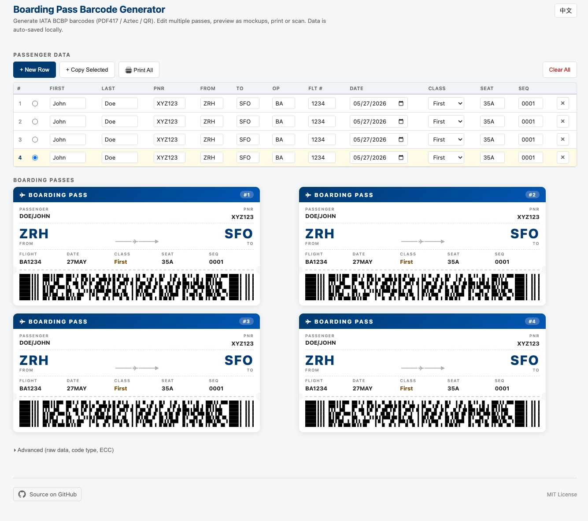

# 登机牌条码生成器

完全在浏览器里运行的 **IATA BCBP 登机牌条码生成器**，支持 **PDF417 · Aztec · QR** 三种码型，并实时渲染成真实样式的登机牌。零后端、零追踪、所有数据都在你自己的浏览器里。

🔗 **在线 demo：<https://harrilee.github.io/BoardingBarcode/>**
🌏 [English README →](./README.md)



---

## 为什么做这个 —— 给航旅纵横"补登机牌"

最主要的用途是 **把一段航班添加到航旅纵横**，不用手动一个字段一个字段地敲。

航旅纵横 APP 支持 **扫描登机牌上的 PDF417 条码** 来添加行程。当你手里没有纸质登机牌时（弄丢了、从境外渠道订票没自动同步、想补录一段历史航班），可以用这个工具生成一张登机牌，然后直接用手机扫屏幕。

### 操作步骤

1. 在电脑上打开 [在线 demo](https://harrilee.github.io/BoardingBarcode/)
2. 在表格里填入：乘客姓名、PNR、出发 / 到达机场 IATA 三字码、航班号、日期、座位号、登机序号
3. 下方的登机牌样张会实时更新，底部就是 PDF417 条码
4. 手机打开 **航旅纵横 → 添加行程 → 扫描登机牌**
5. 把摄像头对准屏幕上的 PDF417 —— 航旅纵横 会识别 IATA BCBP 标准数据并自动填好航班信息

> ✅ 同样的流程也适用于 **Apple Wallet（钱包）**、**Google Wallet**，以及大多数支持 BCBP 标准登机牌的航司自助 App。

---

## 功能

- **PDF417 · Aztec · QR** —— 三种码型覆盖几乎所有航司系统
- **表格化多行编辑** —— 可以同时编辑多张登机牌，一键"复制当前行"或"新增空行"
- **真实样式的登机牌样张** —— 每一行渲染成纸质登机牌的样子，长宽比贴近 IATA ATB2 标准（约 2.4:1）
- **中英双语** —— 一键切换，根据浏览器语言自动判断，选择会写入 URL 参数 `?lang=` 方便分享
- **自动保存** —— 所有乘客数据存在浏览器本地（localStorage），永远不会上传
- **一键打印** —— 打印所有登机牌；打印 CSS 强制黑底白条，保证条码可扫
- **SEO 友好** —— hreflang、JSON-LD 结构化数据、Open Graph 分享卡片
- **100% 前端** —— 没有后端，没有任何会触达乘客信息的请求

---

## 工作原理

条码渲染基于开源的 [Zint](https://www.zint.org.uk/) 条码库，用 Emscripten 编译成 **WebAssembly**。UI 是纯手写 HTML + CSS + 原生 JavaScript，没有构建步骤、没有框架、不需要 npm。

当你修改任意一行时，JS 会按 IATA BCBP M 格式拼出条码字符串：

```
M1DOE/JOHN           EXYZ123 ZRHSFOBA 1234 147F035A0001 100
```

然后交给 wasm 模块，返回 SVG 条码，画到登机牌样张上。

---

## 本地运行

不需要构建：

```bash
git clone https://github.com/Harrilee/BoardingBarcode.git
cd BoardingBarcode
open index.html          # macOS
# xdg-open index.html    # Linux
# start index.html       # Windows
```

如果要改 C / Wasm 层，看 `em_debug_build.bat` / `em_rel_build.bat`，里面是用 Emscripten 编译 Zint 源码的命令。

---

## 免责声明

本工具基于 **公开的 IATA 标准（BCBP / 决议 792）** 生成条码。使用场景仅限于：

- 把 **你自己的航班** 补登到 **你自己** 的航司 / 航旅纵横账号
- 测试条码扫描器和 BCBP 兼容系统
- 学习与开发

请勿用于伪造没有真实搭乘的行程、骗取常旅客积分、或冒充其他乘客身份。**风险自负。**

---

## 参考资料

- [IATA BCBP 实施指南 v4 (PDF)](http://www.iata.org/whatwedo/stb/documents/bcbp_implementation_guidev4_jun2009.pdf)
- [登机牌条码里到底有什么 — Shaun Donnelly](https://shaun.net/whats-contained-in-a-boarding-pass-barcode/)
- [Aztec Code (Wikipedia)](https://en.wikipedia.org/wiki/Aztec_Code)
- [Zint 条码库](https://github.com/zint/zint)

## 致谢

- 原始项目：[shooshx/BoardingBarcode](https://github.com/shooshx/BoardingBarcode)
- 条码引擎：[Zint](https://www.zint.org.uk/)（BSD 协议）
- 本 fork（UI 重构、多行编辑、双语、登机牌样张）：[Harrilee](https://github.com/Harrilee/BoardingBarcode)

## 协议

[MIT](./LICENSE)
